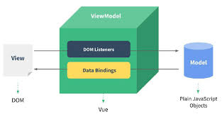

# Vue 开发环境准备

## Visual Studio Code安装及使用

- 下载地址
- [官网](https://code.visualstudio.com/)

## 使用指南

### 代码提示
- 创建hello.js，体验vscode代码提示功能。

```javaScript

    const hello = 'hello';
    console.log(hello);
```

### 调试

- vscode默认支持node调试，**F5**启动调试
- 若要支持网页调试，需安装*Debugger for Chrome*(插件)，如下是基本配置方式：
```javascript

{
    // 使用 IntelliSense 了解相关属性。 
    // 悬停以查看现有属性的描述。
    // 欲了解更多信息，请访问: https://go.microsoft.com/fwlink/?linkid=830387
    "version": "0.2.0",
    "configurations": [
        {
            "type": "chrome",
            "request": "launch",
            "name": "Launch Chrome against localhost",
            "url": "http://localhost:8080",
            "webRoot": "${workspaceFolder}/wwwroot"
        },
        {
            "name": "Launch index.html",
            "type": "chrome",
            "request": "launch",
            "file": "${workspaceFolder}/index.html"
        },
    ]
}
```

### Git集成
*这部分可以用三种方式实现：*
1. vscode自带的**源代码管理器**；
2. view中的**命令面板** git：git指令；
3. **终端** git指令。

- 迁出已存在项目，比如： https://github.com/yxDeveloper/xxx
+ command palette
+ git:*clone*
+ 填入地址回车

- 已存在项目，比如当前项目test
+ source control
+ Initialize Repository
+ 选择test项目
+ git:*Add Remote*
+ 填写remote name为origin
+ 添加remote url为https://github.com/yxDeveloper/test

- 代码提交
+ source control
+ 填写Message
+ Git:*Commit*

- 代码推送
+ Git:*Push*
+ 填写用户名
+ 填写密码

### 扩展
- 安装**vetur**和**vue vscode snippets**

## vue-cli安装及使用

### 安装
```
npm i -g @vue/cli
```
### 使用

- 快速原型开发
+ 首先安装全局扩展
```
npm install -g @vue/cli-service-global
```
+ 启动开发服务器
```
vue serve ./Hello.vue
```
- 创建项目
```
vue create project-name
```
- 使用插件
+ 安装*vue-router*
+*vue add router*


# Vue Hello World 与设计思想

## 引入Vue

## Hello World

- 创建我的第一个Vue程序

```javascript
    <div id="app">{{title}}</div>
    <script src="vue.js"></script>
    <script>
    const app = new Vue({
    el:'#app',
    data: {
    title: 'hello,vue'
    }
    })
    setTimeout(() => {
    app.title = 'mua~,vue'
    }, 1000);
    </script>
```

## 理解Vue的设计思想

- 数据驱动应用
> Vue 是MVVM模式的践行者



- MVVM框架的三要素：响应式、模板引擎及其渲染
+ 响应式：vue如何监听数据变化？
+ 模版：vue的模版如何编写和解析？
+ 渲染：vue如何将模板转换为html？


